# 클라우드 가상화 기술

## 서버 가상화 기술 실습


## 1. KVM (Kernel-based Virtual Machine)

리눅스 커널 모듈 기반의 가상화 기능으로 Intel VT-x 또는 AMD-V를 이용해 가상머신 실행을 가속

- 리눅스를 호스트 OS로 이용하면서 하이퍼바이저 역할 수행
- 가상머신 실행 시 QEMU와 함께 사용
- QEMU는 디바이스 에뮬레이션 및 VM 실행 기능 담당

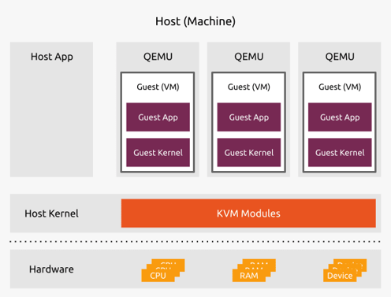

---

## 2. QEMU (Quick Emulator)

PC 환경을 에뮬레이션하는 가상머신 실행기이자 프로세스 에뮬레이터로, KVM과 함께 사용하여 가상머신을 실행

- CPU와 주변 장치(Disk, NIC 등)를 에뮬레이션
- CPU 명령을 변환하여 실행
- CPU 가상화 지원이 없어도 동작 가능(단, 성능 저하 발생)

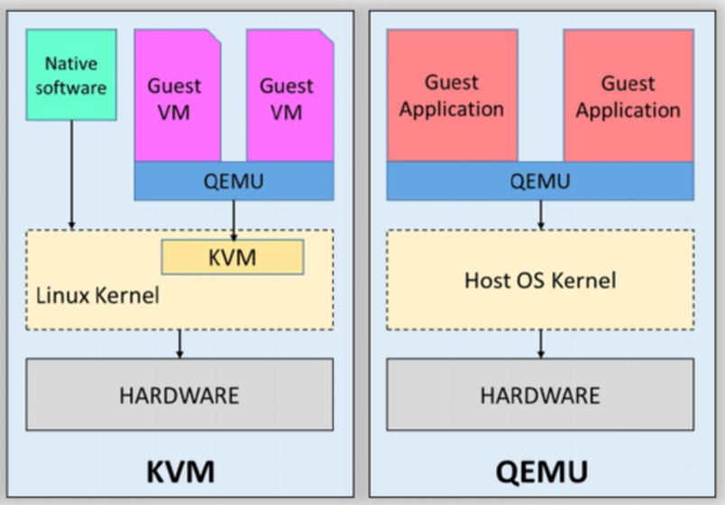

---

## 3. Libvirt

가상화 환경을 관리하기 위한 도구

QEMU-KVM, Xen, VMware 등 다양한 하이퍼바이저를 관리하고 제어하기 위한 **통합 API** 제공

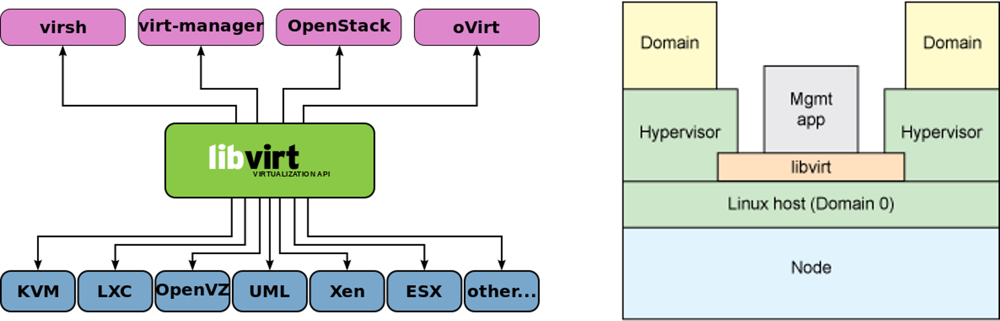

---

## 4. QEMU-KVM 설치

### CPU 가상화 지원 확인

```bash
# CPU 가상화 지원 여부 확인 명령어
egrep -c '(vmx|svm)' /proc/cpuinfo
```

- 결과가 **0이 아니라면 CPU가 하드웨어 가상화(Intel VT-x 또는 AMD-V)를 지원**
- 일부 시스템에서는 **BIOS 또는 UEFI에서 해당 기능이 비활성화**되어 있을 수 있음

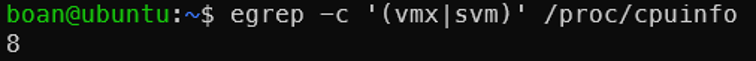

### 참고

- 하드웨어 가상화가 지원되고 활성화되어 있다면 **QEMU + KVM 사용 가능**
- 지원하지 않는 경우 **QEMU만 사용하여 소프트웨어 에뮬레이션 방식으로 실행 가능 (성능 저하)**

---

### QEMU (+ KVM) 설치

```bash
sudo apt-get update

sudo apt-get install -y qemu-kvm libvirt-daemon-system libvirt-clients bridge-utils virt-manager
```

- QEMU와 QEMU + KVM 모두 기본적인 설치 과정은 동일
- CPU가 가상화를 지원하지 않으면 **KVM 가속 사용 불가**

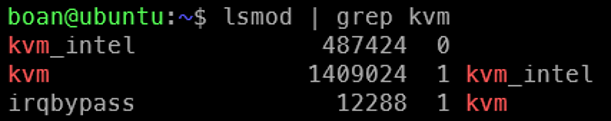

---

### 권한 설정


```bash
# 루트 권한 없이 KVM 명령어를 실행할 수 있도록 설정
sudo usermod -aG libvirt $USER

sudo usermod -aG kvm $USER
```

로그아웃 후 재로그인하여 권한 적용

---

## 5. 가상머신 네트워크 확인

```bash
# 가상머신을 위해 생성된 네트워크 인터페이스 확인
ip a
```

`virbr0` 인터페이스 확인

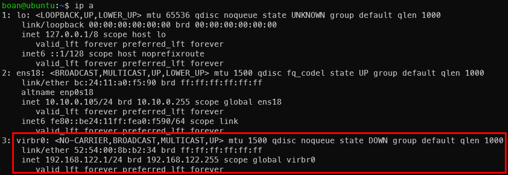

---

### 가상 네트워크 정보 확인


```bash
# 모든 가상 네트워크 확인
virsh net-list --all
```
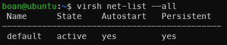


```bash
# 특정 네트워크 정보 확인   
virsh net-info default
```
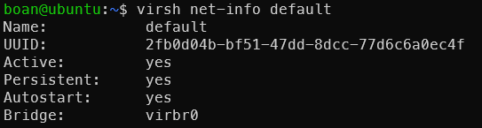


```bash
# 네트워크 설정 XML 출력
virsh net-dumpxml default
```
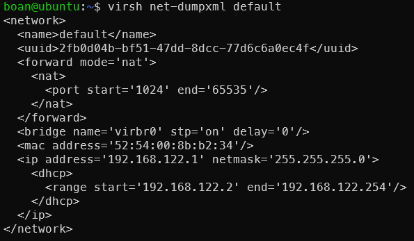
---

## 6. ISO 기반 가상머신 생성

### Ubuntu ISO 다운로드

```bash
wget https://releases.ubuntu.com/24.04/ubuntu-24.04.3-live-server-amd64.iso

sudo mv ubuntu-24.04.3-live-server-amd64.iso /var/lib/libvirt/images/
```

---

### 가상머신 생성

```bash
virt-install --name ubuntu-vm \
--vcpus 2 --ram 2048 \
--disk path=/var/lib/libvirt/images/ubuntu-vm.img,size=20,format=qcow2 \
--cdrom /var/lib/libvirt/images/ubuntu-24.04.3-live-server-amd64.iso \
--network network=default \
--graphics vnc,listen=0.0.0.0 \
--os-variant ubuntu24.04
```

---

## 7. VNC를 통한 가상머신 접속

### RealVNC Viewer 다운로드

https://www.realvnc.com/en/connect/download/viewer/

---

### 가상머신 화면 연결

RealVNC Viewer를 이용하여 가상머신 화면 접속

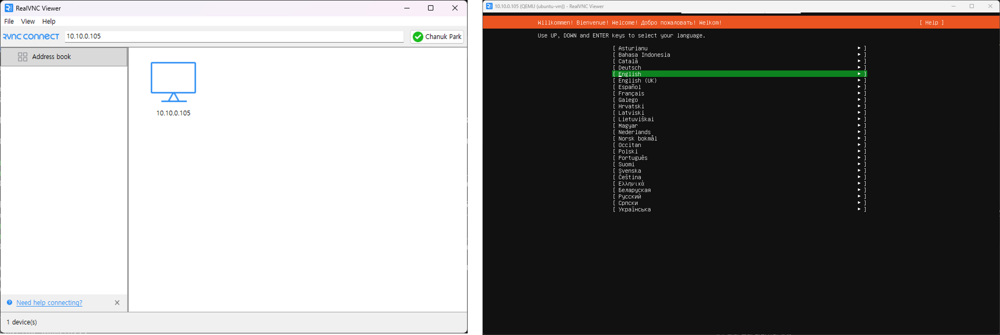

---

### 여러 VM 생성 시 VNC 포트

VNC 포트는 다음 방식으로 자동 할당

```
5900 + display 번호
```

예시

| VM | Display | Port |
|----|--------|------|
| VM1 | 0 | 5900 |
| VM2 | 1 | 5901 |
| VM3 | 2 | 5902 |

VM 종료 시 포트는 재사용됨

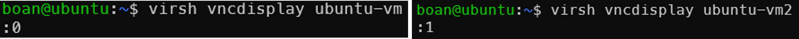
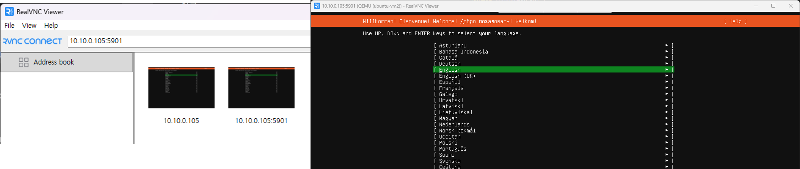

---

## 8. 가상머신 관리 명령어 (virsh)

### VM 목록 확인

```bash
# -all 입력 시 비활성화(종료) 된 VM도 출력
virsh list --all
```

---

### VM 제어

```bash
# VM 시작
virsh start <vm_name> 

# VM 종료
virsh shutdown <vm_name> 

# VM 재시작
virsh reboot <vm_name> 
```

---

### 강제 종료

```bash
# 전원 차단과 같음
virsh destroy <vm_name>
```

---

### 일시정지 / 재개

```bash
# VM 일시정지
virsh suspend <vm_name>
# VM 재개
virsh resume <vm_name>
```

---

### VM 삭제

```bash
# VM 삭제 (디스크는 유지)
virsh undefine <vm_name>
```

```bash
# VM 삭제 (디스크도 함께 삭제)
virsh undefine <vm_name> --remove-all-storage
```

---

## 9. OS 설치 없이 VM 생성 (Cloud Image)

### 패키지 설치

```bash
sudo apt-get install -y cloud-image-utils
```

---

### Ubuntu Cloud Image 다운로드

```bash
wget https://cloud-images.ubuntu.com/noble/current/noble-server-cloudimg-amd64.img

sudo mv noble-server-cloudimg-amd64.img /var/lib/libvirt/images
```

### Ubuntu 코드명

| Version | Codename |
|--------|----------|
| 20.04 | focal |
| 22.04 | jammy |
| 24.04 | noble |

---

## 10. cloud-init 설정

### user-data

```yaml
#cloud-config
hostname: myvm

users:
  - name: ubuntu # 사용자 계정 이름
    sudo: ["ALL=(ALL) NOPASSWD:ALL"] # sudo 입력 시 PW 미입력 설정 (실제 환경에서는 사용하지 않는 걸 추천)
    groups: users, sudo
    home: /home/ubuntu
    shell: /bin/bash
    lock_passwd: false

ssh_pwauth: true # 비밀번호 로그인 활성화

chpasswd:
  list: | # 계정:비밀번호
    ubuntu:ubuntu
  expire: false
```

---

### meta-data

```yaml
local-hostname: myvm
```

---

### network-config (ubuntu 기준 netplan) 

```yaml
version: 2
ethernets:
  enp1s0: # NIC 이름은 환경마다 다를 수 있음 (ens3, eth0 등)
    dhcp4: false
    addresses:
      - 192.168.122.20/24 # VM IP Address
    routes:
      - to: default
        via: 192.168.122.1 # Gateway
    nameservers: # DNS Server
      addresses:
        - 8.8.8.8
```

---

## 11. cloud-init 이미지 생성

```bash
# cloud-localds 명령어로 cloud-init ISO 이미지 생성
sudo cloud-localds -v --network-config=network-config myvm-seed.iso user-data meta-data

# 생성된 ISO 이미지를 VM 디스크 이미지 저장 디렉터리로 이동
sudo mv myvm-seed.iso /var/lib/libvirt/images
```

---

## 12. QCOW2 디스크 생성

```bash
# 디스크 이미지 저장 디렉터리 이동
cd /var/lib/libvirt/images

# noble 이미지 기반 overlay 디스크 생성
# 최대 디스크 크기 20GB
sudo qemu-img create -F qcow2 -b ./noble-server-cloudimg-amd64.img -f qcow2 ./myvm-base.qcow2 20G
```

---

## 13. Cloud Image 기반 VM 생성

```bash
# cloud-init ISO 이미지 연결하여 VM 생성
virt-install --name myvm \
--vcpus 2 --ram 2048 \
--import \
--disk path=/var/lib/libvirt/images/myvm-base.qcow2,format=qcow2 \
--cdrom /var/lib/libvirt/images/myvm-seed.iso \
--network network=default \
--graphics vnc,listen=0.0.0.0 \
--os-variant ubuntu24.04
```

---

## 14. Snapshot 기능

### Snapshot 생성

```bash
# 1. VM 디스크 상태를 external snapshot 방식으로 저장
# 원본 디스크는 backing file로 유지되고, 새로운 overlay 파일에 변경분이 기록됨
# 메모리 상태는 저장되지 않음
virsh snapshot-create-as \
--domain myvm \
--name external_disk_snapshot \
--description "External disk-only snapshot" \
--disk-only \
--atomic \
--diskspec vda,snapshot=external,file=/var/lib/libvirt/images/myvm_overlay.qcow2

# 2. 실행 중인 VM의 디스크 + 메모리(RAM) 상태를 함께 저장하는 full snapshot 생성
# 단, 종료된 VM에서는 메모리 상태가 없으므로 디스크 상태만 저장됨
# 복원 시 Snapshot 시점의 실행 상태까지 함께 복원됨
virsh snapshot-create-as \
--domain myvm \
--name full_snapshot \
--description "Snapshot with memory" \
--atomic

# Snapshot 리스트 확인
virsh snapshot-list myvm

# Snapshot 정보 확인
virsh snapshot-info myvm --snapshotname full_snapshot
```

---

### Snapshot 복원

```bash
# 생성된 snapshot(full_snapshot) 상태로 VM 복원
virsh snapshot-revert --domain myvm --snapshotname full_snapshot
```
`snapshot-revert` 명령어는 생성된 snapshot 상태로 VM을 복원하는 기능

VM이 실행 중일 경우 복원 과정에서 VM이 일시 중지되거나 재시작될 수 있음

메모리 포함 snapshot의 경우 실행 상태까지 함께 복원되며  

disk-only snapshot의 경우 디스크 상태만 복원되고 VM은 재시작 상태로 동작

---

### Snapshot 삭제

```bash
# 스냅샷 메타데이터와 데이터를 함께 삭제
virsh snapshot-delete --domain myvm --snapshotname full_snapshot

# 스냅샷 메타데이터만 삭제
virsh snapshot-delete --domain myvm --snapshotname full_snapshot --metadata
```
--- 

## Q & A

박찬욱   
cupark@dankook.ac.kr

남재현  
namjh@dankook.ac.kr