# 클라우드 가상화 기술

## 컨테이너 기술 실습

## 1. CPU Stress 테스트

### CPU Stress 테스트 도구 설치

```bash
sudo apt update

# CPU 부하 테스트 도구 stress 설치
sudo apt install stress
```

### Stress 테스트 실행

```bash
# CPU를 1개 쓰레드로 100% 사용하도록 부하 생성
stress -c 1
```

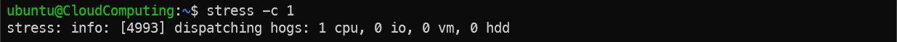

### 리소스 사용량 확인

```bash
# 현재 시스템의 CPU / 메모리 / 프로세스 사용량 확인
top
```

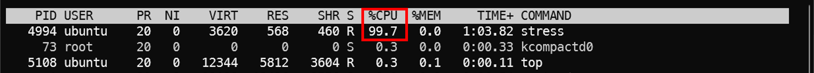

---

## 2. Cgroups를 이용한 CPU 제한

### 테스트를 위한 Cgroup 생성

```bash
# 새로운 cgroup 디렉터리 생성
sudo mkdir /sys/fs/cgroup/mytest
```

```bash
# 현재 쉘 프로세스를 해당 cgroup에 등록 (ssh, vscode terminal 등에서 실행 중인 쉘)
# $$ 는 현재 쉘의 PID를 의미
echo $$ | sudo tee /sys/fs/cgroup/mytest/cgroup.procs

# 현재 쉘이 mytest cgroup에 등록되었는지 확인
cat /proc/$$/cgroup
```

### CPU 제한 설정 (예: 10ms / 100ms = 10%)

```bash
# CPU 사용 제한 설정
# cpu.max 파일은 "<quota> <period>" 형식을 사용
# quota: 사용할 수 있는 CPU 시간
# period: 전체 주기
# 아래 설정은 100ms 중 10ms만 CPU 사용 가능하도록 제한 (10%)
echo 10000 100000 | sudo tee /sys/fs/cgroup/mytest/cpu.max
```

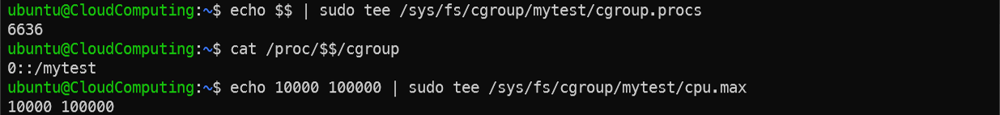

---

## 3. Cgroups를 이용한 CPU 제한 테스트

```bash
# 다시 CPU 부하 생성
stress -c 1
```

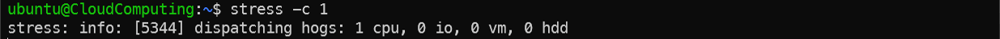

```bash
# CPU 사용량 확인
top
```

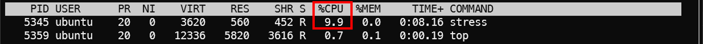

---

## 4. Cgroups를 이용한 생성 가능한 프로세스 수 제한

### 테스트를 위한 Cgroup 생성

```bash
# 프로세스 수 제한 테스트를 위한 cgroup 생성
sudo mkdir /sys/fs/cgroup/myprocs
```

```bash
# 현재 쉘을 해당 cgroup에 등록
echo $$ | sudo tee /sys/fs/cgroup/myprocs/cgroup.procs

# 현재 쉘이 myprocs cgroup에 등록되었는지 확인
cat /proc/$$/cgroup
```

### 프로세스 수 제한 설정

```bash
# 생성 가능한 최대 프로세스 수를 10개로 제한
echo 10 | sudo tee /sys/fs/cgroup/myprocs/pids.max
```

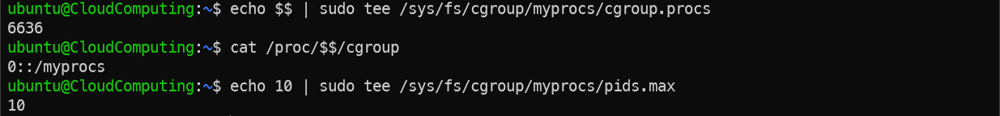

---

## 5. Fork Bomb 테스트

```bash
# Fork Bomb 실행
# 무한히 프로세스를 생성하여 시스템 자원을 소모하는 공격 코드
:(){ :|:& };:
```

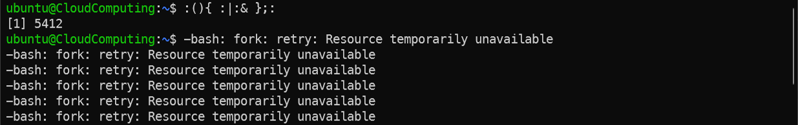

```bash
# 현재 생성된 프로세스 확인
ps aux
```

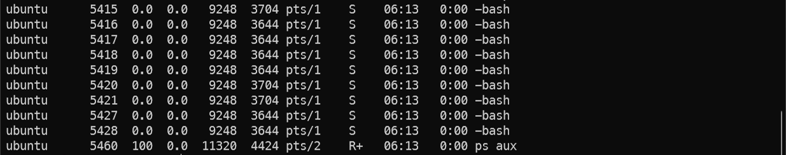

`myprocs cgroup에 프로세스 수 제한을 설정했기 때문에, Fork Bomb이 10개 이상의 프로세스를 생성하지 못하고 제한됨`

#### <span style="color:red">반드시 Fork Bomb 종료할 것 (Fork Bomb 실행한 쉘 종료)</span>

---

### 참고 - 전체 cgroup 확인 방법

```bash
# 전체 cgroup 확인
ls /sys/fs/cgroup/
```

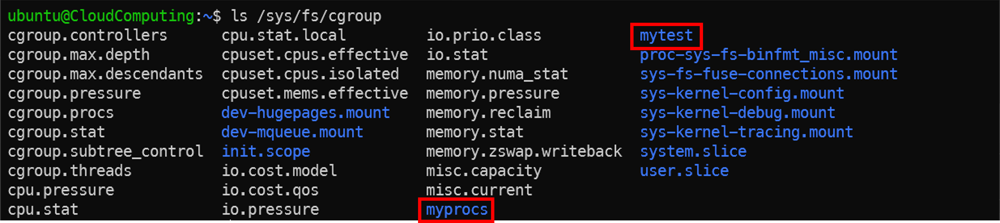

## 6. 새 Mount Namespace 생성

```bash
# 현재 쉘의 PID 확인
echo $$
```

```bash
# 새로운 Mount Namespace 생성
# -m : Mount Namespace 생성
sudo unshare -m /bin/bash
```

```bash
# 새로운 Namespace에서 PID 확인
# 이전 PID와 다르면 새로운 Namespace 생성된 것
echo $$
```

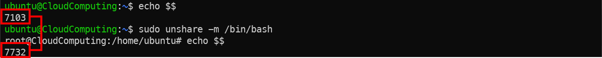

```bash
# 다른 쉘에서 Namespace 내부 쉘의 PID 확인
sudo lsns
```

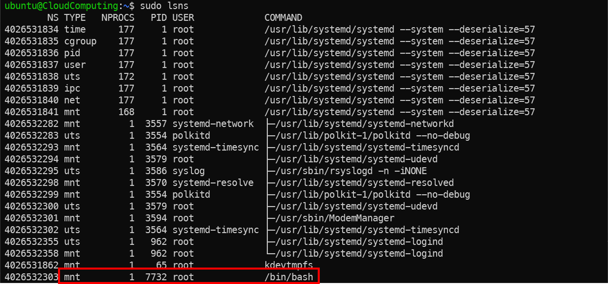

### tmpfs 마운트

```bash
# tmpfs 파일 시스템을 /mnt에 마운트
sudo mount -t tmpfs tmpfs /mnt
```

```bash
# 현재 마운트 상태 확인
mount | grep /mnt
```

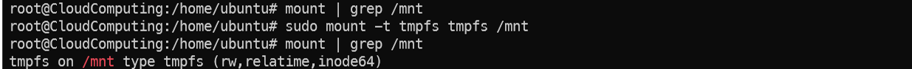

---

## 7. Mount Namespace 격리 확인

```bash
# Mount Namespace 내부에서 파일 생성
echo "hello" > /mnt/hello.txt

# 파일 내용 확인
cat /mnt/hello.txt
```

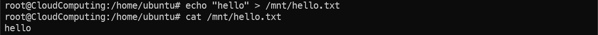

```bash
# 다른 터미널에서 접근 시도
# 같은 경로인지 확인
pwd

# Mount Namespace가 다르기 때문에 접근 불가
cat /mnt/hello.txt
```

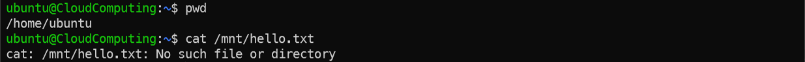


```bash
# 각각의 쉘에서 namespace 정보 확인
ls -l /proc/$$/ns
```

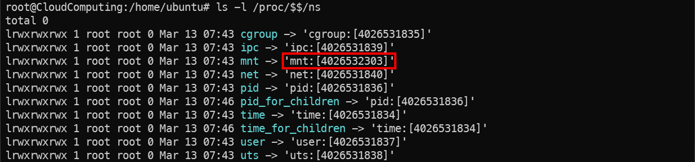   
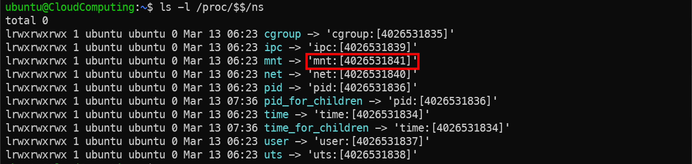

#### `각 Namespace의 mnt만 다르고, 다른 것들은 같은 걸 확인할 수 있음`

---

## 8. nsenter로 Namespace 접근

```bash
# Namespace에 들어가 있는 쉘의 PID 확인
echo $$
```
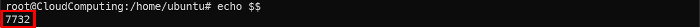

```bash
# 특정 PID의 Mount Namespace로 진입
# [Target PID]는 namespace 내부 프로세스의 PID
# 이 실습에서는 namespace 내부 쉘의 PID를 사용
sudo nsenter -t [Target PID] -m /bin/bash
```

```bash
# namespace 내부 파일 확인
cat /mnt/hello.txt
```

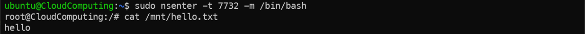

```bash
# namespace 내 모든 프로세스가 종료되면 namespace도 함께 종료됨
# 현재 쉘 두 개에서 접속해 있으므로, 둘 다 종료해야 namespace가 완전히 제거됨
exit
```

``` bash
# 만들었던 Namespace의 PID가 남아있는지 확인
sudo lsns
```

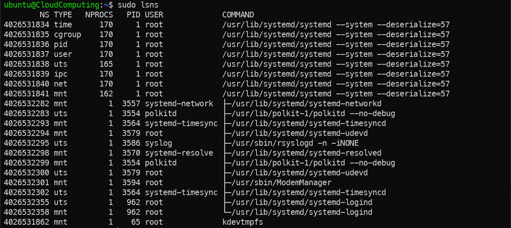

---

## 9. 새 PID Namespace 생성

```bash
# 현재 PID 확인
echo $$
```

```bash
# 새로운 PID Namespace 생성
# -p : PID namespace 생성
# -f : 새로운 자식 프로세스를 생성하여 namespace 내부에서 실행
sudo unshare -pf /bin/bash
```

```bash
# namespace 내부 PID 확인
echo $$
```

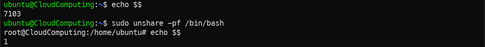

---

## 10. PID Namespace 확인

```bash
# namespace 내부 프로세스 확인
ps aux | head -n 5
```

```bash
# namespace용 proc filesystem 마운트
mount -t proc none /proc
```

```bash
# 다시 프로세스 확인
# namespace 내부 프로세스만 표시됨
ps aux | head -n 5
```

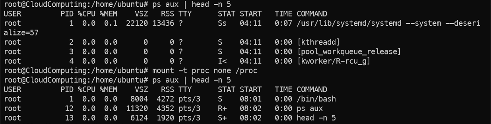

---

## 11. cgroup 및 Namespace 기반 유사 컨테이너 환경 구축

`cgroup과 namespace(PID, Mount, IPC)를 함께 사용하고 root filesystem을 분리하여 컨테이너와 유사한 격리 환경을 생성`

- **cgroup** : CPU 및 프로세스 수 등 리소스 제한  
- **PID namespace** : 독립적인 프로세스 ID 공간  
- **Mount namespace** : 독립적인 파일시스템 mount 테이블  
- **IPC namespace** : Shared Memory, Message Queue 등의 IPC 자원 격리  
- **Root filesystem** : 컨테이너 내부에서 사용할 독립적인 파일시스템

---

### 1. cgroup 및 Root FS 환경 준비 (호스트에서 실행)

`자원 제한을 설정하고 컨테이너에서 사용할 root filesystem을 준비`

```bash
# 1-1. cgroup 생성 및 자원 제한 설정
sudo mkdir -p /sys/fs/cgroup/mycontainer

# CPU 사용 제한 (10%)
echo 10000 100000 | sudo tee /sys/fs/cgroup/mycontainer/cpu.max

# 최대 생성 프로세스 수 제한
echo 20 | sudo tee /sys/fs/cgroup/mycontainer/pids.max
```

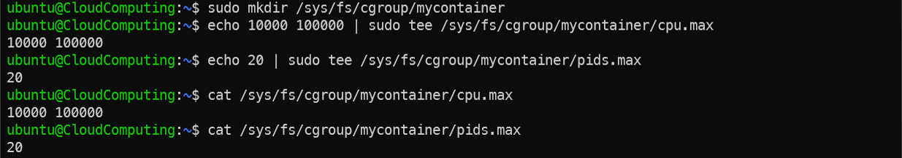

```bash
# 1-2. Root filesystem 디렉터리 생성
export CROOT=/tmp/container-root

# 기존 환경 제거
sudo rm -rf $CROOT

# rootfs 기본 디렉터리 생성
mkdir -p $CROOT/{bin,lib,lib64,proc,usr/bin,dev}
```

```bash
# 1-3. 필수 명령어 및 의존성 라이브러리 복사
# 컨테이너 내부에서 사용할 최소 명령어 구성
for cmd in bash ls cat ps mkdir mount rm; do
    # 명령어 실행 파일 복사
    sudo cp -a $(which $cmd) $CROOT/bin/
    
    # 해당 명령어에 필요한 의존성 라이브러리 목록 추출
    list="$(ldd $(which $cmd) | egrep -o '/lib[^ ]+')"
    
    # 라이브러리 복사 (--parents로 구조 유지, -a로 링크 보존)
    for i in $list; do
        sudo cp -a --parents "$i" "$CROOT"
    done
done
```

```bash
# 1-4. lib64 Ubuntu/Debian 계열의 라이브러리 경로 보정 (심볼릭 링크 포함 전체 복사)
sudo cp -a /lib/x86_64-linux-gnu/* $CROOT/lib/x86_64-linux-gnu/ 2>/dev/null || true

sudo cp -a /lib64/* $CROOT/lib64/ 2>/dev/null || true

sudo cp -a /usr/lib/x86_64-linux-gnu/* $CROOT/usr/lib/x86_64-linux-gnu/ 2>/dev/null || true
```

```bash
# bash가 제대로 복사되었는지 확인
ls -l $CROOT/bin/bash
```

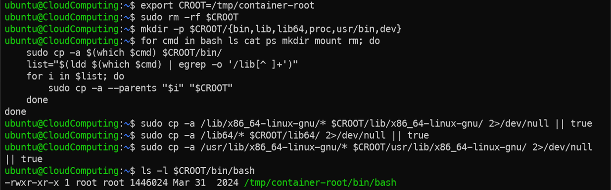

---

### 2. Namespace 격리 환경 생성 (호스트에서 실행)

`PID, Mount, IPC namespace를 생성하여 새로운 격리 환경에서 bash를 실행`

```bash
# -p : PID namespace 생성
# -m : Mount namespace 생성
# -i : IPC namespace 생성
# -f bash: 새로운 PID namespace에서 bash를 실행
sudo unshare -pmif bash
```

---

### 3. 프로세스를 cgroup에 등록 (호스트에서 실행)

`컨테이너 내부에서 실행 중인 bash 프로세스를 cgroup에 등록`

```bash
# 컨테이너 bash PID 확인
pstree -up | grep unshare
```

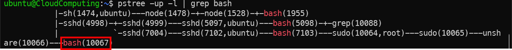

```bash
# 해당 프로세스를 cgroup에 등록
echo [PID] | sudo tee /sys/fs/cgroup/mycontainer/cgroup.procs
```

```bash
# cgroup 적용 여부 확인
cat /sys/fs/cgroup/mycontainer/pids.current
```

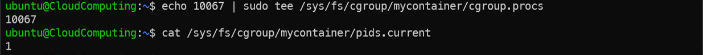

---

### 4. Root Filesystem 격리 (생성된 Namespace 내부에서 실행)

`생성한 root filesystem을 사용하여 chroot 환경으로 진입`

```bash
export CROOT=/tmp/container-root

# $CROOT/proc 마운트 (ps 명령 사용을 위해 필요, 컨테이너 만의 proc 만들기)
mount -t proc proc $CROOT/proc

# root filesystem 변경
chroot $CROOT /bin/bash

# 프로세스 격리 확인 (Namespace 안의 프로세스만 조회되는지 확인)
ps aux
```

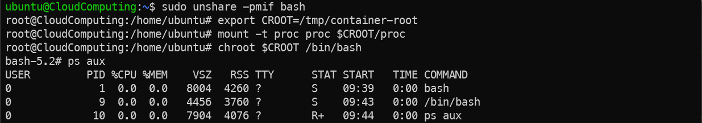

`chroot를 통해 root filesystem이 변경된 bash를 하나 더 띄웠으므로, 프로세스가 2개가 됨`

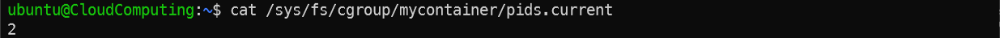

---

### 5. 격리 환경 확인 (생성된 Namespace 내부에서 실행)

```bash
# PID namespace 확인
echo $$
```

```bash
# namespace 내부 프로세스 확인
ps aux
```

```bash
# root filesystem 격리 확인
ls /
```

```bash
# cgroup 적용 확인
cat /proc/self/cgroup
```

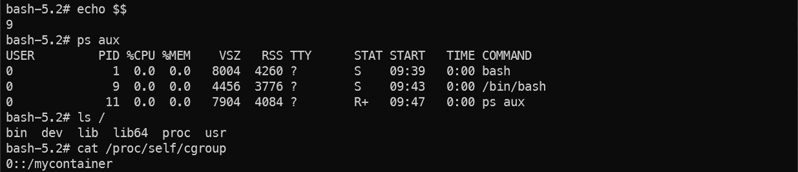

`최소한의 rootfs만 복사하였기 때문에, user 등이 제대로 설정되지 않은 환경임`

---

### 6. 유사 컨테이너 환경 종료

```bash
exit   # chroot 종료
exit   # namespace 종료
```

```bash
# 실습 환경 정리 (선택)
sudo rm -rf /tmp/container-root
sudo rmdir /sys/fs/cgroup/mycontainer
```

---

### 7. 실제 컨테이너와의 차이점

실습에서 `cgroup`, `namespace`, `chroot`를 이용하여 컨테이너와 유사한 격리 환경을 구성
그러나 실제 컨테이너(Docker 등)는 추가적인 기능을 포함하여 보다 완전한 격리 및 관리 환경을 제공

- **Root Filesystem 구성 차이**
  - 실습 환경: 최소 실행 파일과 라이브러리만 포함한 rootfs
  - 실제 컨테이너: 이미지 기반 rootfs 사용 (`/etc`, `/usr`, `/var` 등 전체 OS 환경 포함)

- **네트워크 격리**
  - 실습 환경: 네트워크 namespace 미구성 (week5 내용)
  - 실제 컨테이너: network namespace 및 가상 네트워크(veth, bridge 등) 기반 독립 네트워크 환경

- **보안 기능**
  - 실습 환경: cgroup과 namespace 기반 기본 격리
  - 실제 컨테이너: capabilities, seccomp, AppArmor, SELinux 등을 통한 추가 보안 제한

- **파일시스템 관리**
  - 실습 환경: 단일 root filesystem 사용
  - 실제 컨테이너: 이미지 레이어 및 Copy-on-Write 파일시스템(OverlayFS 등) 기반 파일시스템 관리

- **컨테이너 런타임**
  - 실습 환경: `unshare`, `chroot` 등을 이용한 수동 환경 구성
  - 실제 컨테이너: `containerd`, `CRI-O`, `runc` 등의 컨테이너 런타임 기반 실행 및 관리

---

## Q & A

박찬욱  
cupark@dankook.ac.kr

남재현  
namjh@dankook.ac.kr  

## Networked Systems and Security Lab (BoanLab) @ DKU